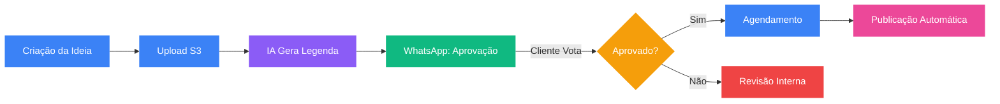
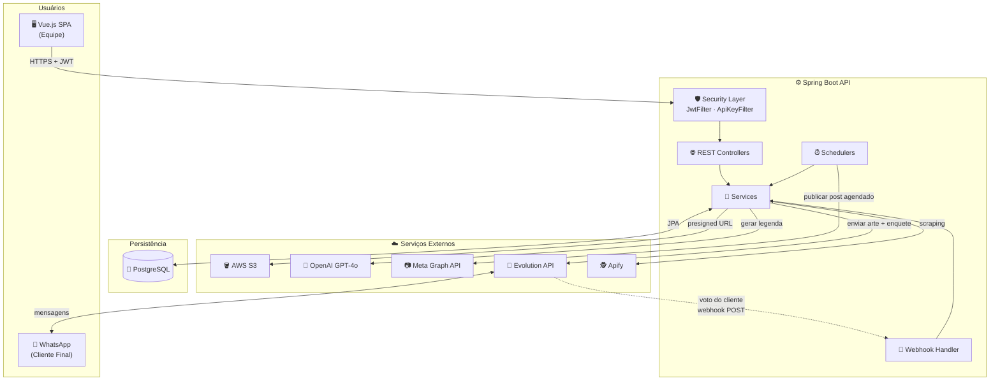
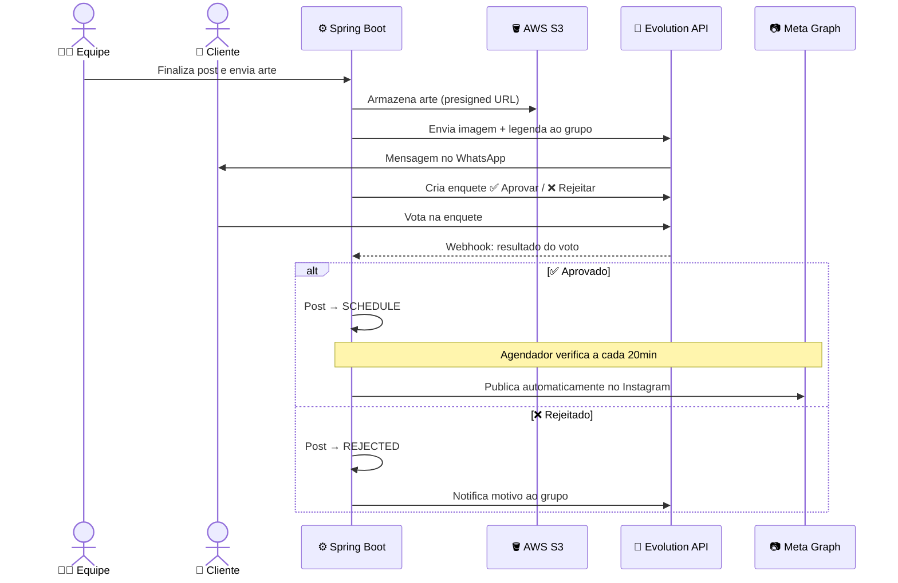
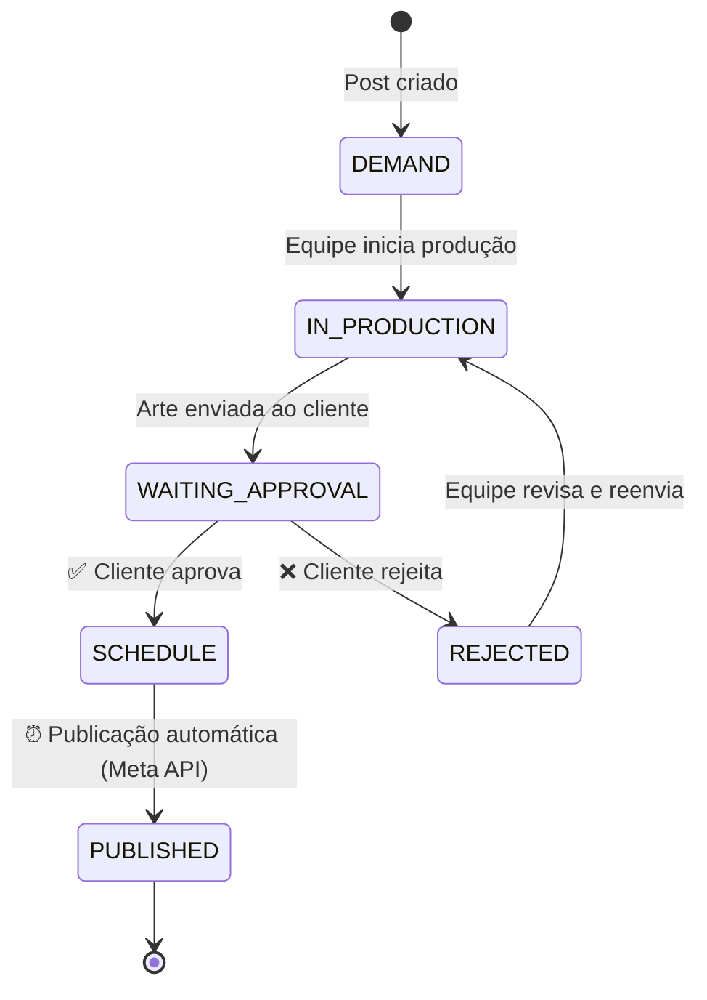
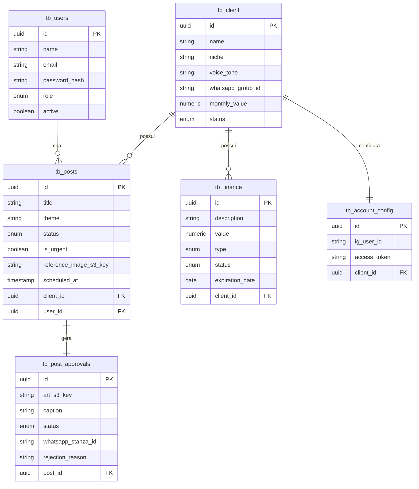

<h1 align="center">
  🎬 North Produções — Gestão de Conteúdo
</h1>

<p align="center">
  Plataforma full-stack inteligente para gestão de produção audiovisual e conteúdo digital.
  <br>Centraliza o fluxo de criação, aprovação interativa, publicação e controle financeiro.
</p>

<p align="center">
  
  
  
  
  
  
</p>

<hr/>

## 📋 Sumário

- [Visão Geral](#-visão-geral)
- [Arquitetura do Sistema](#-arquitetura-do-sistema)
- [Stack Tecnológica](#-stack-tecnológica)
- [Principais Funcionalidades](#-principais-funcionalidades)
- [Pré-requisitos e Instalação](#-pré-requisitos-e-instalação)
- [Configuração do Ambiente](#-configuração-do-ambiente)
- [Guia de API e Endpoints](#-guia-de-api-e-endpoints)
- [Estrutura de Banco de Dados](#-estrutura-de-banco-de-dados)
- [Segurança e Autenticação](#-segurança-e-autenticação)
- [Deploy e CI/CD](#-deploy-e-cicd)

---

## 🚀 Visão Geral

O sistema automatiza e orquestra o ciclo completo de vida de um conteúdo digital para clientes de uma agência, minimizando atrito e garantindo entregas consistentes.



**Papéis no Sistema:**
- 🛡️ **ADMIN** — Controle total do ecossistema: clientes, publicações, finanças, integrações sistêmicas e gestão de equipe.
- 👤 **USER** — Operação diária: criação de posts, acompanhamento de board, envio para aprovação.

---

## 🏗️ Arquitetura do Sistema

A arquitetura foi desenhada para ser modular, resiliente e altamente integrada a serviços em nuvem.

<details open>
<summary><b>📐 Visão Geral dos Componentes</b></summary>



</details>

---

<details open>
<summary><b>📬 Fluxo de Aprovação via WhatsApp</b></summary>



</details>

---

<details>
<summary><b>🔄 Ciclo de Vida de um Post</b></summary>



</details>

---

<details>
<summary><b>🗂️ Relacionamento das Entidades</b></summary>



</details>

---

## 🛠️ Stack Tecnológica

**Backend (Core)**
*   **Linguagem:** Java 21
*   **Framework:** Spring Boot 4.0.6 (REST API)
*   **Segurança:** Spring Security + JJWT 0.13.0
*   **Persistência:** Spring Data JPA + Flyway + PostgreSQL 17
*   **Integrações:** Spring AI (OpenAI GPT-4o), AWS SDK v2
*   **Gestão de Pacotes:** Maven 3.9.9

**Frontend (SPA)**
*   **Linguagem:** TypeScript 6.0
*   **Framework:** Vue.js 3.5 + Vite 8.0
*   **Roteamento e Estado:** Vue Router 5.0 + Pinia 3.0
*   **Estilização:** Tailwind CSS 3.4 + Lucide Vue
*   **Validação:** Zod 4.0

---

## ✨ Principais Funcionalidades

| Categoria | Descrição |
| :--- | :--- |
| **🎨 Gestão de Fluxo** | Board Kanban visual (`DEMAND` → `IN_PRODUCTION` → `WAITING_APPROVAL` → `SCHEDULE` → `PUBLISHED`). Upload direto via URLs pré-assinadas (S3). |
| **🤖 Inteligência Artificial** | Geração de legendas usando GPT-4o, com base no tema, objetivo e identidade/nicho do cliente. |
| **📱 Aprovação Omnichannel** | Enquetes de aprovação no WhatsApp. Sem necessidade de logins externos. Ações computadas instantaneamente via Webhooks. |
| **⚙️ Automação de Redes** | Publicação automática no Instagram via Meta Graph API em posts agendados (`SCHEDULE`), verificados a cada 20 minutos. |
| **💰 Gestão Financeira** | Controle de receitas/despesas por cliente, previsão anual agrupada por mês e filtros (PENDING/PAID). |

---

## 💻 Pré-requisitos e Instalação

- [Java 21 JDK](https://adoptium.net/)
- [Node.js 22+](https://nodejs.org/)
- [Docker e Docker Compose](https://www.docker.com/) (Recomendado)
- [Maven 3.9+](https://maven.apache.org/)

---

## ⚙️ Configuração do Ambiente

Crie um arquivo `.env` na raiz do repositório baseado no `.env_example`:

```env
# Banco de Dados
DB_URL=jdbc:postgresql://localhost:5432/producoes
DB_USER=postgres
DB_PASSWORD=sua_senha

# JWT
JWT_KEY=base64_encoded_secret_256bits

# AWS S3
AWS_ACCESS_KEY_ID=sua_access_key
AWS_SECRET_ACCESS_KEY=sua_secret_key
AWS_S3_BUCKET=north-producoes
AWS_S3_REGION=sa-east-1
AWS_S3_PUBLIC_BASE_URL=https://seu-bucket.s3.amazonaws.com

# OpenAI
OPENAI_API_KEY=sk-...
OPENAI_MODEL=gpt-4o

# Meta Graph API (Instagram)
META_GRAPH_ACCESS_TOKEN=seu_token
META_GRAPH_API_VERSION=v19.0

# Evolution API (WhatsApp)
EVOLUTION_API_BASE_URL=https://sua-instancia.evolution.com
EVOLUTION_API_KEY=sua_chave
EVOLUTION_API_INSTANCE=nome_da_instancia
EVOLUTION_WEBHOOK_SECRET=uuid_aleatorio

# Apify
APIFY_API_TOKEN=seu_token

# Admin Inicial
BOOTSTRAP_ADMIN_NAME=Admin
BOOTSTRAP_ADMIN_EMAIL=admin@agencianorth.com
BOOTSTRAP_ADMIN_PASSWORD=senha_segura

# API Interna (server-to-server)
INTERNAL_API_KEY=chave_aleatoria_segura

# Profile
SPRING_PROFILES_ACTIVE=dev
```

**Frontend (`frontend/.env`)**:
```env
VITE_API_BASE_URL=http://localhost:8080
```

### Rodando o Projeto

**Via Docker Compose (Recomendado):**
```bash
# Sobe banco de dados, backend e frontend
docker compose -f docker-compose.local.yml up --build -d
```
> Acesse: `http://localhost`

**Manualmente:**
*   **Backend:** `mvn spring-boot:run` (Disponível em `http://localhost:8080`)
*   **Frontend:** `cd frontend && npm install && npm run dev` (Disponível em `http://localhost:5173`)

---

## 🔌 Guia de API e Endpoints

<details>
<summary><b>Ver Endpoints da API</b> (Clique para expandir)</summary>

### 🔑 Autenticação
* `POST /api/auth/login` (Público) - Login via e-mail e senha
* `POST /api/auth/register` (ADMIN) - Registro de usuário
* `POST /api/auth/refresh` (Público) - Atualização do JWT

### 👥 Usuários
* `GET /api/users` (ADMIN) - Listagem paginada
* `GET /api/users/me` (AUTH) - Perfil logado
* `PATCH /api/users/id/{id}/role` (ADMIN) - Alterar permissão
* `DELETE /api/users/id/{id}` (ADMIN) - Soft delete

### 🏢 Clientes
* `GET /api/clients` (AUTH) - Listagem de clientes
* `POST /api/clients` (ADMIN) - Criação de cliente
* `PATCH /api/clients/{id}/status` (ADMIN) - Alternância de status

### 📝 Posts e Fluxos
* `GET /api/posts` (AUTH) - Listagem de posts
* `POST /api/posts/save` (ADMIN) - Novo post
* `POST /api/posts/{id}/generate-caption` (AUTH) - Geração de legenda (IA)

### 💬 Aprovações (WhatsApp)
* `GET /api/post-approvals/all` (ADMIN) - Todas as aprovações
* `POST /api/post-approvals/save` (ADMIN) - Disparo de aprovação
* `POST /api/webhooks/whatsapp/{secret}` (Webhook) - Recebe eventos Evolution

### ☁️ Upload (Mídia S3)
* `GET /api/media/upload-url` (AUTH) - Gera Presigned URL de envio
* `POST /api/media/upload-complete` (AUTH) - Confirmação

### 💰 Financeiro
* `GET /api/finance/forecast?year=` (ADMIN) - Previsão financeira anual
* `POST /api/finance` (ADMIN) - Registro de movimentação

### 🔐 API Interna (Server-to-Server)
*Requer header `X-Internal-Api-Key`*
* `PATCH /api/internal/approvals/post/{postId}/approve`
* `PATCH /api/internal/approvals/post/{postId}/reject`

</details>

---

## 🗄️ Estrutura de Banco de Dados

Gerenciado via **Flyway Migrations** (PostgreSQL).

| Tabela | Função Principal |
| :--- | :--- |
| `tb_users` | Credenciais, roles e soft-delete de equipe |
| `tb_client` | Informações de faturamento e persona para IA |
| `tb_posts` | Core business e agendamento de conteúdos |
| `tb_post_approvals` | Log e controle de estado do WhatsApp (Evolution API) |
| `tb_finance` | Lançamentos IN/OUT agrupados por status e categoria |
| `tb_account_config` | Contas Meta vinculadas para automação social |
| `tb_refresh_tokens` | Segurança do sistema de JWT contínuo |

---

## 🔒 Segurança e Autenticação

- **Autenticação:** Baseada em JWT com Hash `HMAC-SHA-256`, duração de 24h. Refresh Tokens armazenados com hash seguro na base.
- **Autorização:** Isolamento baseado em roles (`ADMIN` vs `USER`) gerenciado através de anotações `@PreAuthorize` e custom `JwtFilter`.
- **CORS:** Restrito à interface de produção (`agencianorth.com`) ou origens seguras, com abertura para webhooks e endpoints internos (`/api/internal/**`).
- **API Interna:** Endpoints server-to-server protegidos com header `X-Internal-Api-Key`.

---

## 🚢 Deploy e CI/CD

Pipeline CI/CD configurada usando **GitHub Actions** (`main.yml`).

1. Monitoramento automático de mudanças nos sub-diretórios (Backend/Frontend).
2. Construção Multi-stage via Dockerfile (Node 22 p/ SPA via Nginx, Alpine JRE 21 p/ API).
3. Publicação contínua de imagens Docker (`producoes-api:latest`, `producoes-web:latest`) no **GitHub Container Registry**.
4. Execução local escalonável usando os `compose.yaml` fornecidos.